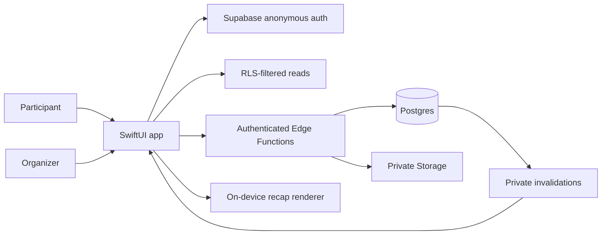

# Mosaic

## Reverie Hacks 2026 - App Development Project Documentation

**Tagline:** Small acts. One shared story.
**Platform:** iOS 18+, SwiftUI
**Repository:** https://github.com/shellcat-com/Mosaic
**Privacy:** https://shellcat-com.github.io/Mosaic/privacy/
**Terms:** https://shellcat-com.github.io/Mosaic/terms/
**Contact:** biswas06@iastate.edu

## Purpose

Kind acts usually disappear into private moments. Existing social products often make participation visible through rankings, likes, streaks, or public profiles, which can turn generosity into performance. Mosaic gives a school, neighborhood, workplace, nonprofit, or friend group a shared kindness goal without ranking participants.

Each accepted act becomes one equal-size ceramic tile. The artwork stays sealed while the group contributes, then opens in a synchronized reveal with consent-approved memories, an on-device recap, and an attributable Impact Receipt. Purchases never make one person's contribution larger or more prominent.

## Target audience

Mosaic is designed for participants age 13 or older in invited groups and for organizers who need a private, understandable way to run a kindness challenge. The primary audiences are schools, student groups, neighborhoods, nonprofits, workplaces, and friend groups. The Reverie Hacks judge environment uses synthetic names and media only.

## Main features

- Adaptive three-scene onboarding, invitation-link bypass, and returning-member restoration.
- Anonymous guest joining with independent first-name or anonymous identity choices.
- Invitation-only challenges entered through a short code, QR code, or link.
- Reflection, photo, video, receipt, and organizer-approval evidence paths.
- Separate consent for evidence review, community-memory inclusion, identity display, and recap export.
- Organizer moderation with server-authorized lifecycle transitions.
- Equal-weight ceramic tiles shaped by mission, emotion, and evidence type.
- Pass the Tile chains and restrained kintsugi-gold renewal, without competitive scoring.
- Membership-scoped Realtime invalidations for synchronized collaboration.
- Scheduled or manual reveal, approved memories, and an exact Impact Receipt.
- On-device vertical recap rendering with consent filtering and credited music.
- Home Screen and Lock Screen widgets, Live Activity infrastructure, local reminders, and Apple Calendar editing.
- Cached read-only recovery and a bundled showcase when the backend is unavailable.
- VoiceOver labels, Dynamic Type layouts, Reduce Motion behavior, and non-color status communication.

## Judge in 60 seconds

### Requirements

- macOS with Xcode 26 or newer.
- An iPhone Simulator running iOS 18 or newer.
- Internet access for the hosted synthetic judge project; the offline showcase remains available without it.

### Run

```sh
git clone https://github.com/shellcat-com/Mosaic.git
cd Mosaic
open Mosaic.xcodeproj
```

Select the **Mosaic Hackathon** scheme, choose an iPhone Simulator, and press Run. No private credentials are required. The build contains only the hosted project's public URL and publishable key. If the project is unreachable, Mosaic loads its bundled read-only showcase automatically.

For local backend development, install Docker, the Supabase CLI, XcodeGen, `curl`, and `jq`, then run:

```sh
supabase start
supabase db reset
supabase functions serve
./supabase/functions/tests/integration.sh
```

Local commands are maintainer-only tools. Debug, Hackathon, and Release builds default to the same hosted HTTPS judging project; maintainers must opt in explicitly if they want to test against a different hosted project.

## User guide

1. Open Mosaic and join as a guest with a display name and privacy preference.
2. Enter the seeded challenge code or open the prepared organizer sandbox.
3. Choose a kindness mission and review the accepted evidence options.
4. Submit a reflection or synthetic media item, then choose memory, attribution, and export consent independently.
5. As an organizer, review evidence and the proposed shared memory separately.
6. Place the verified tile. A second member sees the mosaic update through a private Realtime invalidation followed by an RLS-filtered refresh.
7. Trigger the reveal to open the artwork, approved memories, Impact Receipt, and recap editor.
8. Open Profile > Privacy & consent or Profile > About Mosaic for public privacy and terms links.

## Technical architecture



`AppStore` is the observable UI source of truth. One `SupabaseClient` is shared across authentication, challenge, shared-moment, recap, organization, and billing services. Reads are constrained by Postgres grants and Row Level Security. Sensitive lifecycle mutations go through authenticated Edge Functions that validate the caller before a narrow service-role write.

Evidence, identity, consent, approved memories, and abstract tile state are separated. Private Storage objects are returned only through short-lived signed URLs after authorization. Realtime messages contain challenge and record identifiers, never evidence or owner records; they tell clients to refetch canonical RLS-filtered state.

Tile placement uses a challenge-scoped advisory lock and the first available position, preventing collisions during concurrent writes. Scheduled reveals run through a minute-level database cron, with a manual organizer trigger for the demonstration.

## Privacy and security

The judge build is anonymous and contains synthetic data only. The committed Supabase project URL and publishable key are public client identifiers, not privileged credentials. Service-role keys, database passwords, CLI tokens, Apple credentials, and webhook secrets are never included in the application or repository.

Every exposed application table has RLS and explicit minimum grants. Policies combine `auth.uid()` with challenge or organization membership; possession of the authenticated Postgres role is not sufficient. Private evidence and recap media use separate Storage buckets and authorization paths. The app does not include advertising, IDFA access, or cross-app tracking.

The Mosaic app privacy manifest declares approved reasons for standard UserDefaults, file timestamps used by the recap cache, and disk-capacity checks used before export. The widget extension separately declares App Group UserDefaults. Public privacy and terms pages are linked inside the app.

## Verification

```sh
xcodegen generate

xcodebuild \
  -project Mosaic.xcodeproj \
  -scheme Mosaic \
  -destination 'platform=iOS Simulator,name=iPhone 17 Pro' \
  test

supabase test db
supabase db lint --local
supabase db advisors --local
supabase migration list --local
```

The recap export suite serializes media-heavy cases and validates each new template independently. Tests retain real 1080 x 1920, 30 fps, H.264 video and AAC audio checks while keeping fingerprint verification fast and isolated.

## Configuration

- `Debug`: local Supabase development and optional RevenueCat Test Store.
- `Hackathon`: disposable hosted synthetic project, anonymous auth, billing disabled, Apple account-linking entry points hidden, and offline showcase fallback.
- `Release`: future public App Store configuration; production service values remain external.

`Config/Hackathon.xcconfig` may contain only a Supabase URL and publishable key. Contributor secrets belong in ignored local configuration or external secret stores.

The checked-in targets use Apple Development team `697L2CL757`. Simulator judges need no signing account. Repository users who archive under another team must override both target team values and register matching app, widget, and App Group identifiers, as described in the README.

## Known boundaries and future work

The Reverie submission does not depend on RevenueCat products, App Store Connect subscriptions, production Sign in with Apple, production push delivery, TestFlight, or App Review. Those integration paths are implemented or scaffolded but require owner-controlled dashboards, agreements, and sandbox validation before a public launch. Partner confirmation is also a post-v1 verification path and is not presented as complete.

The disposable hosted judge project will be rotated or retired after judging. The bundled showcase remains a permanent, credential-free record of the product journey.

## References and credits

- Supabase Swift, Auth, Postgres, RLS, Realtime, Storage, Edge Functions, and Cron: https://supabase.com/docs
- RevenueCat iOS SDK and Paywalls: https://www.revenuecat.com/docs
- Apple privacy manifests and required-reason APIs: https://developer.apple.com/documentation/bundleresources/privacy-manifest-files
- SwiftUI: https://developer.apple.com/xcode/swiftui/
- Fraunces is bundled under the SIL Open Font License 1.1.
- Onboarding artwork is sourced from public-domain works made available by the Art Institute of Chicago.
- Recap music attribution, licenses, source URLs, checksums, and verification dates are recorded in `Mosaic/Resources/Music/MusicManifest.json` and `THIRD_PARTY_NOTICES.md`.
- Source code is available under the MIT License.

## Submission checklist

- Public source repository opens without requesting access.
- The `Mosaic Hackathon` scheme launches from a fresh clone without private credentials.
- Hosted anonymous collaboration and the offline showcase are both demonstrated.
- Automated iOS, database, RLS, and Edge Function checks pass.
- The demo video uses synthetic data, readable captions, and a sub-three-minute runtime.
- This project document is available as both Markdown and PDF.
- Privacy and terms links are public and reachable from inside the app.
- Production billing, Apple authentication, push delivery, and App Store work are clearly labeled post-hackathon scope.

## Demonstration safety

The submitted video, screenshots, seed data, invitation codes, and hosted judge project contain synthetic information only. Dashboard identifiers, privileged keys, database passwords, access tokens, and real participant media are excluded from every public artifact.
