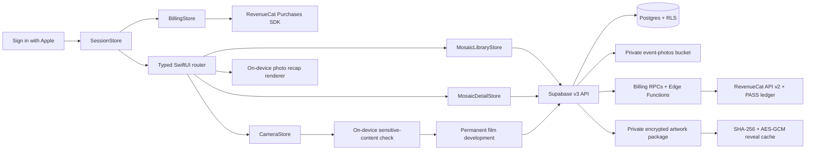

# Mosaic

> A shared kindness challenge without rankings or points.

Mosaic lets a school, neighborhood, workplace, nonprofit, or friend group turn small acts of kindness into one collaborative artwork. A signed-in organizer chooses activities, reviewed public-domain artwork, a disposable-film look, a per-member shot limit, and a fixed reveal time. Members join by QR code or invitation link, confirm each activity at most once, and add one equal-size tile. No proof, ranking, score, organizer approval, or configurable privacy mode exists.

The in-app camera is a separate, photo-only disposable roll. A kept frame consumes a shot; retakes do not. The event film look is permanently developed into the JPEG before upload. Before reveal, photographers see only their own sealed roll. At reveal, joining, kindness confirmations, and photography close; every joined member receives the completed artwork, the readable Kindness side, and the eligible photo gallery.

Each member can build a personal 1–24-photo vertical recap. Selection order is preserved and each selected photo appears once. Templates control layout, transition, grade, and timing; music can be selected and trimmed. Artwork, names, notes, activities, captions, title cards, statistics, and impact receipts are structurally absent from the recap model and renderer. Recaps render on-device and are saved or shared locally.

## Product structure

| Tab | Purpose |
| --- | --- |
| **Mosaics** | Active and completed events, Create, Join, activities, artwork, kindness, gallery, and recap entry. |
| **Camera** | Event selector, viewfinder, film look, shots remaining, review/retake, and the photographer's sealed roll. |
| **You** | Display name, joined events, support, blocked users, sign out, and account deletion. |

The shipping target lives in `MosaicV3/`. The prior hackathon implementation remains in `Mosaic/` only to preserve the pre-existing dirty working tree; `project.yml` excludes it except for the reviewed design system, disposable-film processor, fonts, art, and music assets.

## Architecture



The app uses Swift 6, SwiftUI, Observation, AVFoundation, Sensitive Content Analysis, PhotoKit add-only access, Supabase Swift, and RevenueCat Purchases 5.82.0. RevenueCatUI is intentionally not included: the “Make room for more people” Living Kiln paywall is native SwiftUI and all package prices and periods come from RevenueCat. Networking, photo storage, safety analysis, billing, and recap rendering are isolated behind actors; UI stores are `@MainActor @Observable`.

The intentionally destructive v3 migration is [`supabase/migrations/20260824235234_mosaic_v3_core_rebuild.sql`](supabase/migrations/20260824235234_mosaic_v3_core_rebuild.sql). It preserves migration history but replaces the non-production product schema. Back up any linked project before applying it. It is not automatically pushed by this repository.

The focused billing migration is [`supabase/migrations/20260826061805_v3_revenuecat_billing.sql`](supabase/migrations/20260826061805_v3_revenuecat_billing.sql). It captures `free`, `organizer_plus`, or `event_pass` on each Mosaic, mirrors server-confirmed billing state, and implements idempotent PASS reservation and webhook replay protection. Participants are always free. Free organizers receive one unrevealed Mosaic, 9–25 tiles, 12 shots per member, and Sunwashed. Plus or one PASS unlocks 36–100 tiles, 24/36 shots, and all film looks; Plus also allows multiple active Mosaics. Captured event access never expires mid-event.

After the hosted migration, run [`scripts/prepare_v3_artwork_packages.mjs`](scripts/prepare_v3_artwork_packages.mjs) with `SUPABASE_URL` and `SUPABASE_SERVICE_ROLE_KEY` in the environment. It encrypts pending reviewed JPEGs with per-Mosaic AES-256-GCM keys, uploads ciphertext to the private bucket, and registers release material through service-role-only RPCs. Never place the service-role key in the app or repository.

## Build and verification

Requirements: Xcode 26+, iOS 18+, XcodeGen, Supabase CLI, and Docker for local database tests. Copy `Config/Local.xcconfig.example` to the ignored `Config/Local.xcconfig` and provide only the RevenueCat Test Store **public** SDK key. Server secrets belong in Supabase secrets as `REVENUECAT_PROJECT_ID`, `REVENUECAT_SECRET_API_KEY`, and `REVENUECAT_WEBHOOK_SECRET`; never put them in an xcconfig.

```sh
xcodegen generate
xcodebuild -project Mosaic.xcodeproj -scheme 'Mosaic Shipaton Debug' \
  -destination 'platform=iOS Simulator,name=iPhone 17 Pro' test

supabase start
supabase db reset
supabase test db
supabase db lint --local --schema public --schema private
deno test --config supabase/functions/refresh-billing/deno.json \
  supabase/functions/_shared/revenuecat_test.ts
deno test --config supabase/functions/revenuecat-webhook/deno.json \
  supabase/functions/revenuecat-webhook/index_test.ts
```

RevenueCat catalog contract: offering `organizer_plus_v1`, entitlement `organizer_plus`, products `organizer_monthly`, `organizer_annual`, and `mosaic_event_pass_v2`, and virtual currency `PASS`. The iOS client uses the lowercase Supabase UUID as RevenueCat `appUserID`. CustomerInfo can show purchase progress, but premium controls unlock only after `refresh-billing` reconciles the server snapshot.

Current automated results and the remaining device/release gates are recorded in [`docs/V3_ACCEPTANCE_STATUS.md`](docs/V3_ACCEPTANCE_STATUS.md), with requirement-level traceability in [`docs/V3_REQUIREMENT_EVIDENCE.md`](docs/V3_REQUIREMENT_EVIDENCE.md).

Native Sign in with Apple must be enabled for `com.biswaskhatiwada.mosaicapp`, and the same Apple client ID must be enabled in Supabase Auth. Anonymous sign-in and manual identity linking are disabled in [`supabase/config.toml`](supabase/config.toml).

## Safety and privacy

Mosaic is invitation-only by invariant. Nonmembers cannot read event content or media. Before reveal, members can see shared tile progress but only their own notes and photos; organizers receive no extra access. After reveal, only members who joined in time can read eligible contributions and photos. A photo report quarantines the photo immediately, blocking filters its creator from that member's gallery and recap choices, and photographers may delete their own photos. See [`docs/APP_STORE_DISCLOSURES.md`](docs/APP_STORE_DISCLOSURES.md) and the public pages under [`site/`](site/).

## Design and attribution

The visual language is Mosaic's own Living Kiln system. [Bubbbly by Ann Nguyen](https://www.bubbbly.com/) informed warmth, tactile object-first presentation, and retro-camera personality. The supplied Filmera/Tailii flows informed the mechanics of invitations, disposable rolls, shared galleries, and personal recap creation. No code, branding, assets, copy, or layouts were copied from either reference.

Artwork, typeface, and music licensing is recorded in [`THIRD_PARTY_NOTICES.md`](THIRD_PARTY_NOTICES.md). Design rationale is documented in [`design/DESIGN_DIRECTION.md`](design/DESIGN_DIRECTION.md).
