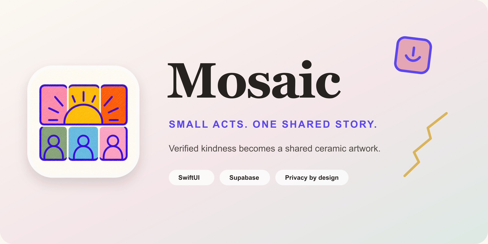
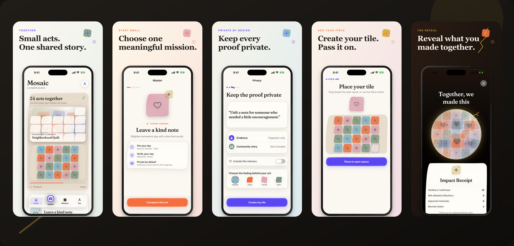
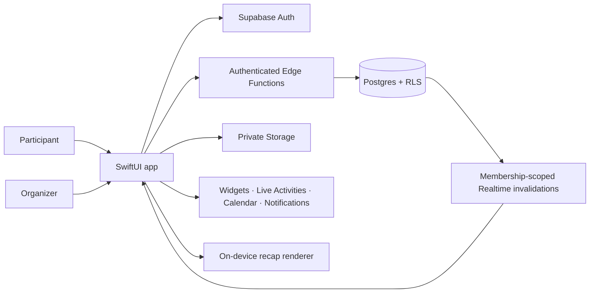

<p align="center">
  
</p>

<p align="center">
  <strong>Verified acts of kindness become one equal-weight collaborative ceramic artwork.</strong>
</p>

<p align="center">
  <a href="https://www.swift.org/"></a>
  <a href="https://developer.apple.com/ios/"></a>
  <a href="https://developer.apple.com/xcode/swiftui/"></a>
  <a href="https://supabase.com/"></a>
  <a href="LICENSE"></a>
</p>

Mosaic gives a school, neighborhood, workplace, nonprofit, or friend group a shared kindness challenge without rankings or points. Each privately verified contribution creates one equal-size ceramic tile. The growing artwork stays sealed until a synchronized reveal opens the final mosaic, approved memories, and an attributable Impact Receipt.

Built for the App Development track at **Reverie Hacks 2026**, the repository includes the SwiftUI app, Supabase backend, private media flows, organizer moderation, widgets, Live Activity infrastructure, recap generation, and a fully judgeable offline showcase.

## See the story unfold

<p align="center">
  
</p>

The gallery is built from deterministic **real simulator UI**, not generated product screens. Full-size App Store exports live in [`design/marketing/app-store`](design/marketing/app-store).

## How Mosaic works

| 1. Choose an act | 2. Verify privately | 3. Place your tile | 4. Reveal together |
| --- | --- | --- | --- |
| Pick an approachable mission that fits your time and energy. | Submit an accepted reflection, photo, video, receipt, or organizer approval. | Emotion, mission, and evidence shape an equal-size ceramic tile. | The kiln opens the artwork, approved memories, recap, and Impact Receipt. |

**Pass the Tile** lets a participant invite someone else to continue the chain. A dormant chain that comes back to life receives a restrained kintsugi-gold connection—a symbol of renewal, never a ranking or premium advantage.

## Built for trust

| Principle | Product behavior |
| --- | --- |
| **Private by default** | Evidence is organizer-only and remains separate from community-story consent. |
| **Equal visual weight** | Every verified act creates the same-size tile; purchases never make a contribution more prominent. |
| **Invitation only** | V1 challenges are unlisted and entered through a private link, QR code, or short code. |
| **Consent-aware memories** | Identity, reveal inclusion, and recap/export consent are independent decisions. |
| **Accessible ceremony** | VoiceOver, Dynamic Type, Reduce Motion, Reduce Transparency, and non-color states are first-class behavior. |
| **Attributable impact** | The receipt separates verified, confirmed, and self-attested outcomes instead of using vague claims. |

## Architecture



The client never promotes itself through lifecycle states. Authenticated Edge Functions authorize transitions, Postgres constraints preserve invariants, and Row Level Security isolates challenges, organizations, evidence, identities, memories, and billing state. See [`docs/ARCHITECTURE.md`](docs/ARCHITECTURE.md) and [`SECURITY.md`](SECURITY.md) for the complete trust model.

## Quick start

### Judge in 60 seconds

Requirements: **Xcode 26+** and an iPhone Simulator.

```sh
git clone https://github.com/shellcat-com/Mosaic.git
cd Mosaic
open Mosaic.xcodeproj
```

Select the shared **Mosaic Hackathon** scheme and run it on an iPhone Simulator. Choose **Explore Demo**. No Docker, Supabase CLI, environment variables, local server, or credentials are required. The committed public client configuration connects every build to the hosted judging project; if first-launch connectivity fails, Mosaic opens its clearly labeled bundled read-only showcase and retries the cloud when the app becomes active. For the exact three-minute judging path, follow [`docs/DEMO_SCRIPT.md`](docs/DEMO_SCRIPT.md).

The stable showcase invitation code is **KIND42**. The convenience landing page is [shellcat-com.github.io/Mosaic/?join=KIND42](https://shellcat-com.github.io/Mosaic/?join=KIND42); the code remains the source of truth if a browser cannot open the custom app scheme.

### Backend development (maintainers only)

Additional requirements: XcodeGen, Docker, Supabase CLI, `curl`, and `jq`.

```sh
supabase start
supabase db reset
supabase functions serve
```

Normal Debug, Hackathon, and Release builds always use the hosted judging backend. A maintainer may override the public URL/key at build time with another hosted HTTPS Supabase project; localhost and unresolved configuration are rejected by the app.

Run the two-user lifecycle check in another terminal:

```sh
./supabase/functions/tests/integration.sh
```

## Verification

```sh
xcodebuild \
  -project Mosaic.xcodeproj \
  -scheme Mosaic \
  -destination 'platform=iOS Simulator,name=iPhone 17 Pro' \
  test

supabase test db
supabase db lint --local
```

After editing `project.yml`, regenerate the Xcode project with:

```sh
xcodegen generate
```

## Hosted judging backend

The repository is preconfigured for `https://lmemddtpwfbkawlkwthf.supabase.co`. Its committed publishable key is a public client identifier protected by explicit grants and RLS. Never add a secret key, service-role key, database password, Apple credential, or CLI/access token to the app or repository.

```sh
xcodebuild \
  -project Mosaic.xcodeproj \
  -scheme Mosaic \
  -destination 'platform=iOS Simulator,name=iPhone 17 Pro' \
  SUPABASE_URL='https://YOUR_MAINTAINER_PROJECT.supabase.co' \
  SUPABASE_PUBLISHABLE_KEY='sb_publishable_YOUR_PUBLIC_KEY'
```

For contributor-only values, create `Config/Local.xcconfig`; that path is ignored by Git. Production push, Live Activity, RevenueCat, and Apple authentication setup are documented under [`docs/`](docs).

<details>
<summary><strong>Implemented product and platform capabilities</strong></summary>

- Anonymous guest onboarding with name and identity-privacy choices.
- Native Sign in with Apple linking that preserves the anonymous Supabase UUID and contributions.
- Owner, admin, and reviewer workspaces; seven-day single-use invites; organization switching.
- RevenueCat Paywall V2, Organizer Plus state, restore, and atomic non-expiring PASS redemption.
- Synthetic read-only showcase plus a deterministic per-installation organizer sandbox.
- Reflection, photo, video, receipt, and organizer-approval evidence paths.
- Private evidence and memory storage with signed upload and download access.
- Independent memory inclusion, identity display, and export-consent controls.
- Separate organizer decisions for evidence and memories.
- Atomic tile placement, private Realtime invalidations, and synchronized manual or scheduled reveal.
- Membership-scoped event agenda with upcoming, active, reveal, and retained recap states.
- Exact reveal times, revision-aware reminders, Apple Calendar editing, and deep links.
- App Group caching, Home Screen and Lock Screen widgets, and Live Activity infrastructure.
- Privacy-safe recap thumbnails and consent-aware vertical recap export.
- Cached read-only recovery and retryable local drafts when writes fail.
- RLS, explicit Data API grants, pgTAP policies, Edge Functions, seed data, and minute-level reveal cron.

Partner confirmation is intentionally labeled as post-hackathon work and is not required by judged missions. Push and Live Activity delivery require the Apple and Supabase production credentials described in [`docs/NOTIFICATIONS.md`](docs/NOTIFICATIONS.md); local reminders, Calendar editing, widgets, cached recaps, and the bundled showcase work without them.

</details>

## Project map

| Path | Purpose |
| --- | --- |
| [`Mosaic/`](Mosaic) | SwiftUI application, design system, domain models, repositories, and Supabase adapters. |
| [`MosaicWidgets/`](MosaicWidgets) | Home Screen, Lock Screen, and Live Activity presentation. |
| [`MosaicTests/`](MosaicTests) | UI-state, lifecycle, transport, consent, theme, and design-system tests. |
| [`supabase/migrations/`](supabase/migrations) | Schema, RLS, Storage, Realtime, cron, and atomic state transitions. |
| [`supabase/functions/`](supabase/functions) | Authenticated server-side lifecycle and organization operations. |
| [`supabase/tests/`](supabase/tests) | pgTAP isolation, billing, theme, recap, notification, and lifecycle tests. |
| [`design/`](design) | Living Kiln direction, vector identity, concept boards, and reproducible marketing assets. |

## Documentation

- [`PRODUCT_BLUEPRINT.md`](PRODUCT_BLUEPRINT.md) — product thesis, roles, lifecycle, privacy, and v1 boundary.
- [`design/DESIGN_DIRECTION.md`](design/DESIGN_DIRECTION.md) — Living Kiln visual system and interaction principles.
- [`docs/ARCHITECTURE.md`](docs/ARCHITECTURE.md) — trust boundaries and data flow.
- [`docs/DEMO_SCRIPT.md`](docs/DEMO_SCRIPT.md) — three-minute Reverie Hacks judging walkthrough.
- [`docs/NOTIFICATIONS.md`](docs/NOTIFICATIONS.md) — Apple capabilities, Edge Function secrets, and scheduling.
- [`docs/MONETIZATION_SETUP.md`](docs/MONETIZATION_SETUP.md) — RevenueCat, App Store Connect, webhooks, and Apple auth.

Public policies: [Privacy](https://shellcat-com.github.io/Mosaic/privacy/) · [Terms](https://shellcat-com.github.io/Mosaic/terms/)

## License and credits

Source code is available under the [MIT License](LICENSE). Fraunces and all third-party or public-domain artwork credits are documented in [`THIRD_PARTY_NOTICES.md`](THIRD_PARTY_NOTICES.md).
