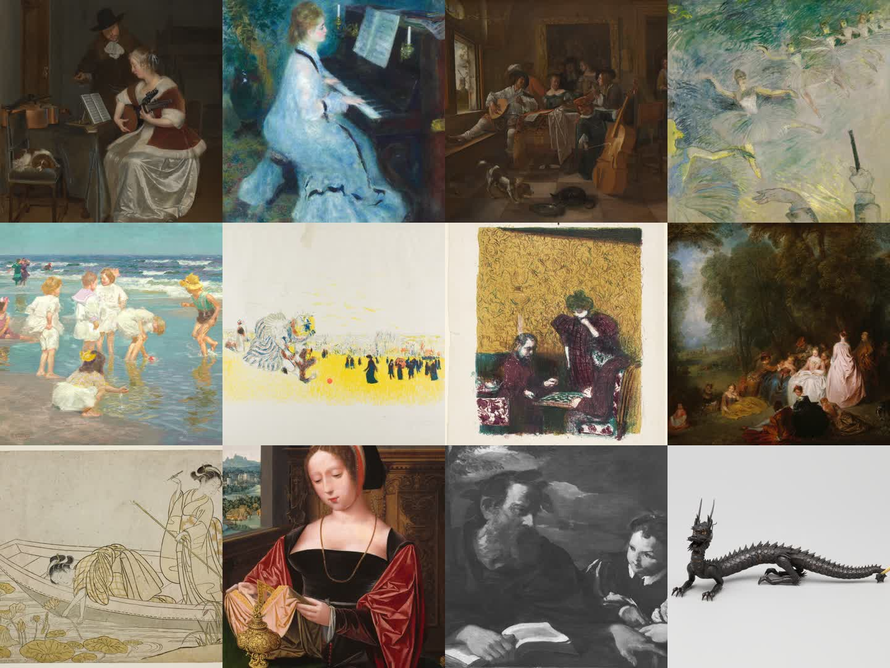

# Mosaic museum catalog review

Catalog revision 2 adds twelve Art Institute of Chicago works that are explicitly marked `CC0 Public Domain Designation`. The selection strengthens five previously thin interest groups while preserving Mosaic's square-crop reveal system.

The contact sheet is ordered left-to-right, top-to-bottom:

| # | Collection | Artwork | Museum record |
| --- | --- | --- | --- |
| 1 | Music | The Music Lesson — Gerard ter Borch the Younger | [AIC 512](https://www.artic.edu/artworks/512) |
| 2 | Music | Woman at the Piano — Pierre-Auguste Renoir | [AIC 25825](https://www.artic.edu/artworks/25825) |
| 3 | Music | The Family Concert — Jan Steen | [AIC 561](https://www.artic.edu/artworks/561) |
| 4 | Music | Ballet Dancers — Henri de Toulouse-Lautrec | [AIC 9148](https://www.artic.edu/artworks/9148) |
| 5 | Play | A Holiday — Edward Henry Potthast | [AIC 71573](https://www.artic.edu/artworks/71573) |
| 6 | Play | Children's Games — Edouard Jean Vuillard | [AIC 83812](https://www.artic.edu/artworks/83812) |
| 7 | Play | The Game of Checkers — Edouard Jean Vuillard | [AIC 80621](https://www.artic.edu/artworks/80621) |
| 8 | Gathering | Fête champêtre (Pastoral Gathering) — Jean Antoine Watteau | [AIC 107938](https://www.artic.edu/artworks/107938) |
| 9 | Gathering | Gathering Lotus Flowers — Suzuki Harunobu | [AIC 20010](https://www.artic.edu/artworks/20010) |
| 10 | Learning | A Lady Reading (Saint Mary Magdalene) — Master of the Female Half-Lengths | [AIC 80538](https://www.artic.edu/artworks/80538) |
| 11 | Learning | Homer Dictating — Pier Francesco Mola | [AIC 5304](https://www.artic.edu/artworks/5304) |
| 12 | Discovery | Articulated Dragon — Myochin School | [AIC 129](https://www.artic.edu/artworks/129) |

The individual 1686-pixel review downloads live in `v2-candidates/`. They are review artifacts only and are not bundled into the iOS target. Production delivery remains on demand through the private museum-artwork storage and reveal-package pipeline.

The Art Institute requests an artist/title/date/museum caption when reproducing open-access images. Mosaic preserves the museum source URL, title, artist, date, license label, accessibility description, and curated crop in the catalog manifest.
