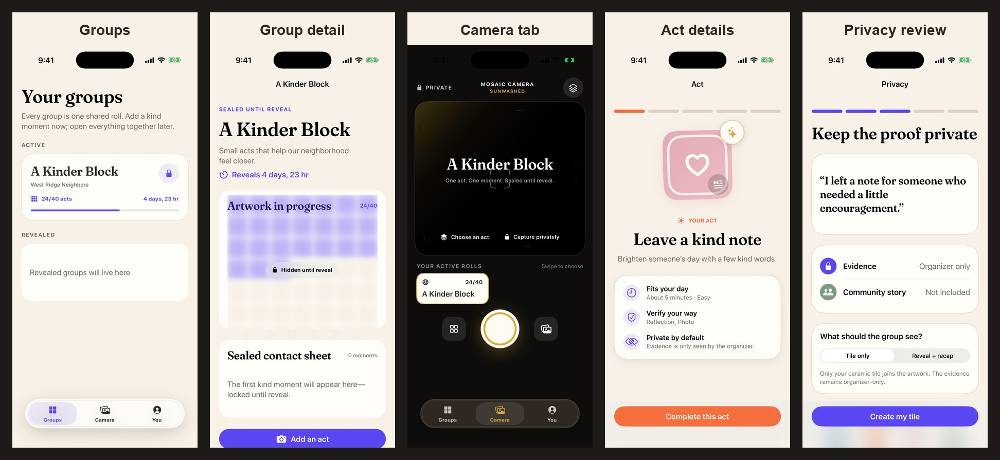
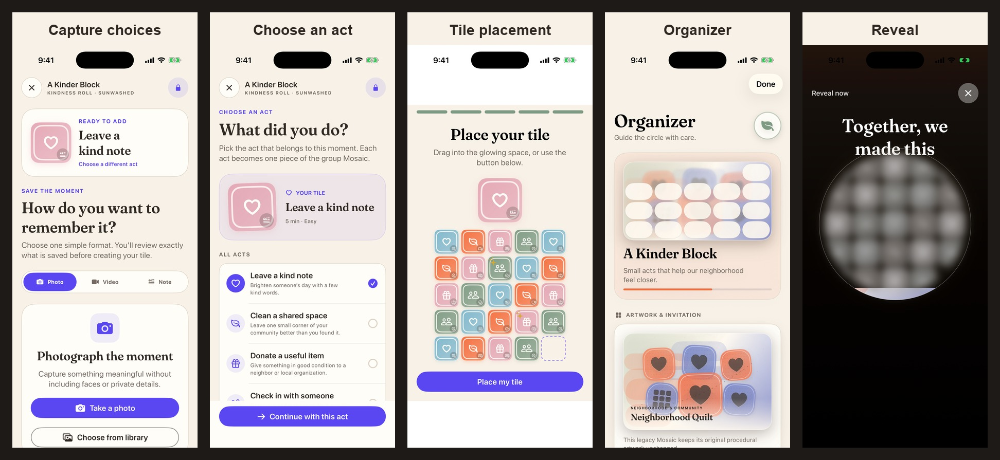
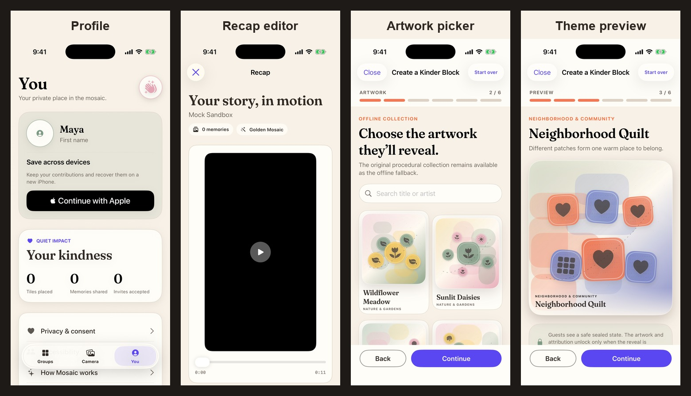

# Mosaic UI review

Captured from the current working-tree UI in the iPhone 17 Pro Simulator on August 24, 2026.

## Overview

## Individual screens

| Area | Screenshot |
| --- | --- |
| Groups | [Open](home.png) |
| Group detail | [Open](folder.png) |
| Camera tab | [Open](add.png) |
| Act details | [Open](mission.png) |
| Privacy review | [Open](privacy.png) |
| Capture choices | [Open](capture.png) |
| Choose an act | [Open](memory.png) |
| Tile placement | [Open](placement.png) |
| Organizer tools | [Open](organizer.png) |
| Reveal | [Open](reveal.png) |
| Profile | [Open](profile.png) |
| Recap editor | [Open](recap-editor.png) |
| Artwork picker | [Open](theme-picker.png) |
| Theme preview | [Open](theme-artwork.png) |

The deterministic debug preview routes were used so each screen reflects the same seeded Mosaic state and is easy to compare.
