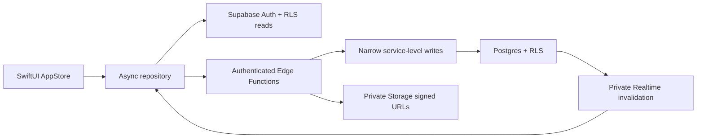
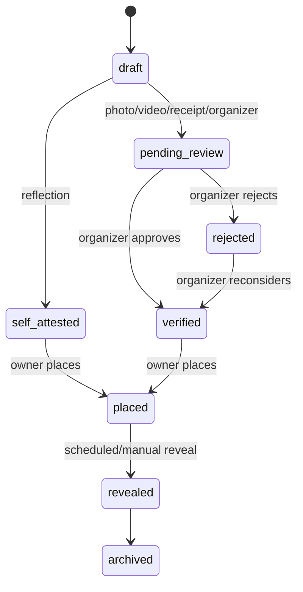

# Mosaic architecture and privacy model

## System boundary

`AppStore` remains the observable UI source of truth. `AppDependencies` owns one `SupabaseClient` shared by auth, challenges, shared moments, recaps, organizations, and billing. RevenueCat is configured only after a Supabase session exists and always uses that session's UUID. When the backend is unavailable, the last successful snapshot remains readable and failed writes stay visible as retryable drafts; Supabase is authoritative whenever connectivity returns.

Organization authorization lives in `organization_members`, never auth metadata. Participants remain only in `challenge_members`. RevenueCat state is presentation data on-device; Edge Functions enforce plan limits from synchronized `billing_accounts` and `challenge_access_grants`.

## Data separation

| Data | Table or bucket | Who can read it |
| --- | --- | --- |
| Abstract tile state | `contributions` | Challenge members; revealed showcase tiles are public to authenticated guests |
| Participant and consent | `contribution_owners` | Owner and challenge organizer |
| Reflection/media metadata | `evidence_submissions` | Owner and organizer |
| Approved story | `memories` | Owner/organizer before reveal; members only after approval and reveal |
| Evidence object | `evidence-private` | Signed access after owner/organizer authorization |
| Approved recap memory object | `recap-memories` | Signed access after memory authorization |
| Moderation history | `moderation_actions` | Organizers only; append-only from Edge Functions |

Every exposed table has RLS. Membership checks include both `auth.uid()` and challenge identity; merely holding the `authenticated` role is insufficient.

## Lifecycle

`public.internal_place_tile` takes a challenge-scoped advisory lock and chooses the first free position, preventing collisions under concurrent requests. The cron job activates due reveals every minute, while `set-reveal` gives organizers a manual demo trigger.

## Realtime

Postgres sends sanitized change notifications to private topics named `challenge:<uuid>`. Authorization policies on `realtime.messages` require current challenge membership. Payloads include only a challenge ID, record type, record ID, and change kind—never evidence, memory text, or ownership. The app treats a broadcast as an invalidation and refetches canonical RLS-filtered state.

## Evidence constraints

- Photo and receipt: JPEG or PNG, at most 10 MiB.
- Video: QuickTime or MP4, at most 25 MiB and at most 10 seconds.
- Reflection: required text, self-attested without media.
- Organizer approval: moderation request without media.
- Partner confirmation: documented post-hackathon scope and excluded from missions.

## Remaining external release work

The code paths for Apple linking, RevenueCat purchases, webhooks, PASS redemption, and account deletion are implemented. Shipping still requires the Apple/RevenueCat dashboard values, hosted Edge Function secrets, store products, Paywall V2 design, privacy/terms URLs, sandbox testing, and App Review approval described in `MONETIZATION_SETUP.md`. Partner verification remains post-v1 scope.
