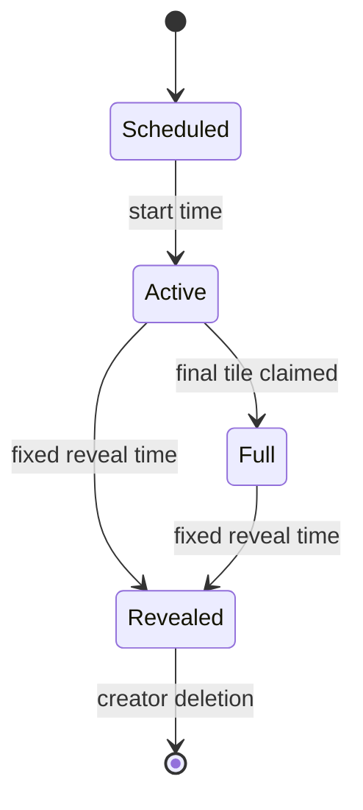

# Mosaic v3 product architecture

## Product promise

Mosaic gives an invited community a shared kindness challenge without rankings or points. Organizer-created activities produce equal tiles through self-attested participation. A separate disposable camera preserves the event in photos. At one fixed reveal time, the complete artwork and the shared photo gallery open to members who joined in time.

## Canonical vocabulary

| Term | Meaning |
| --- | --- |
| **Mosaic** | One invitation-only, time-bounded community event. |
| **Activity** | An organizer-written way to take part. |
| **Contribution** | One account's self-attested completion of one activity, with an optional note. |
| **Tile** | One equal-size board position claimed atomically by a contribution. |
| **Photo** | A developed JPEG captured by Mosaic's event camera; never proof and never a tile. |
| **Gallery** | Eligible event photos, private to each photographer until reveal and shared with joined members afterward. |
| **Recap** | A participant's local export made only from 1–24 selected gallery photos. |

## Stable navigation

- **Mosaics:** create, join, active/completed events, activities, board, artwork, kindness, gallery, recap entry.
- **Camera:** select an active Mosaic, capture, review/retake, keep, and manage the photographer's sealed roll.
- **You:** identity, memberships, support, blocked users, sign out, and deletion.

One typed router handles destinations. The tab meanings never change.

## Lifecycle

- Joining is permitted only before reveal.
- Structural settings lock at start; name and description remain editable until reveal.
- A member may complete each activity once, edit the optional note, or withdraw before reveal.
- A full board closes kindness confirmations but not photography.
- Reveal closes all input and completes the artwork even when positions were unfilled.
- Contributed tiles turn first; remaining porcelain positions then complete the image.

## Outcome separation

After reveal the event exposes three explicit destinations:

1. **Artwork:** the finished public-domain work and attribution.
2. **Kindness:** tile fronts opening activity, optional note, contributor, and time.
3. **Photos:** the eligible gallery and personal recap builder.

No mixed story, impact receipt, official organizer recap, or cloud recap object exists.

## Safety boundary

Mosaic has no organizer approval queue or configurable moderation. The fixed shared-content safety layer is on-device sensitive-content screening, creator deletion, member reporting, contributor blocking, developer support, and server-enforced quarantine. These are product invariants rather than organizer settings.
