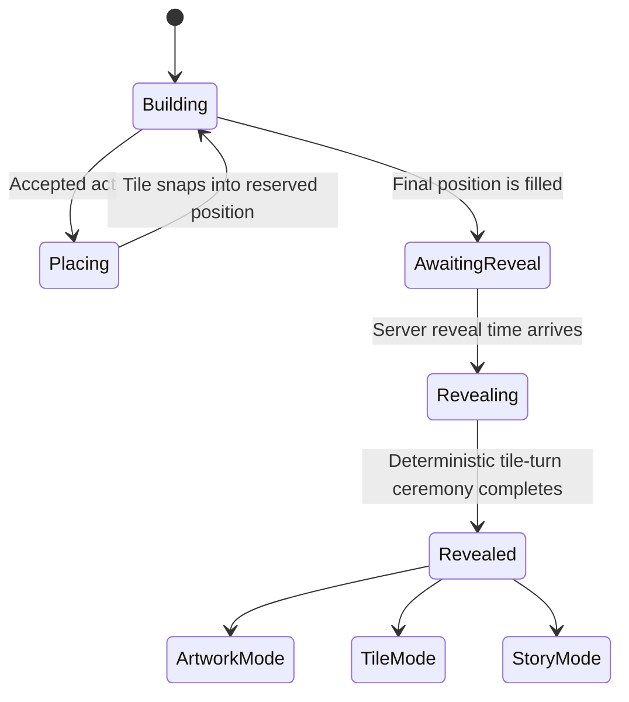
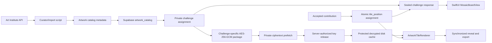

# Mosaic Tile-to-Artwork Reveal Architecture

## Product decision

Each accepted act creates one equal-size, two-sided tile:

- The **front** is the participant's ceramic contribution tile.
- The **back** is that position's exact crop of the selected artwork.

Before reveal, the client receives only ceramic contribution data, collection, palette, and board side. It receives no reconstructable blur, fragment, museum ID, image ID, source URL, or assignment ID. At reveal, the server releases the challenge-specific decryption key and every client runs the complete deterministic tile-turn animation.

The artwork catalog size and the tile count are independent. A Mosaic chooses one artwork from the reviewed catalog. Its goal is one of the supported square capacities: 9, 16, 25, 36, 49, 64, 81, or 100.

## Experience states



### Building

- Show one unified board, not a hidden-art card plus a separate tile grid.
- Filled positions show ceramic fronts.
- Empty positions use quiet porcelain placeholders.
- A palette-only color field may sit beneath the board; no derivative of the painting is delivered.
- Show the exact count and reveal time: `24 of 25 acts` and `Reveals Friday at 7:00 PM`.

### Placing

- The earned tile floats above the board.
- One server-assigned open position glows.
- The tile follows the drag gesture and magnetically aligns near the target.
- Dropping within the target snaps it into place with haptic feedback and a neighboring ripple.
- A `Place my tile` button performs the same action for VoiceOver, Switch Control, motor accessibility, and users who prefer tapping.
- Do not download or briefly expose the full artwork during this state.

### Awaiting reveal

- Freeze new placements when contributions close.
- Show the sealed board, countdown, notification control, and replay-safe local state.
- Avoid fake real-time animation; every device uses the server reveal timestamp.

### Revealing

- Transition from porcelain daylight to kiln-night.
- Turn tiles over in a deterministic wave based on `tile_position`.
- The back of each tile draws the corresponding crop from one shared artwork image.
- Kintsugi gold may travel only across revived-chain positions.
- Complete in 6–8 seconds with Skip and Replay controls.
- Reduce Motion replaces flips, travel, blur, and depth with staged crossfades.

## Animation recommendation

Use an explicit `RevealPhase` state machine plus one shared `revealProgress` value. Each tile derives its own local progress from the shared value and its position. Do not start a separate task, timer, or delayed animation for every tile.

| Approach | Fit for Mosaic | Decision |
| --- | --- | --- |
| One delayed `withAnimation` per tile | Quick for a tiny demo, but difficult to cancel, skip, replay, synchronize, and test at 100 tiles | Do not use |
| `PhaseAnimator` for every tile | Clear discrete phases, but excessive when repeated across the complete board | Use only for outer ceremony phases if helpful |
| `KeyframeAnimator` for every tile | Precise but its content updates every frame; unnecessary cost and complexity for a uniform tile wave | Do not use for the board |
| One global progress with derived tile progress | Deterministic, cheap, testable, synchronized, and easy to skip or replay | Recommended |

Suggested state:

```swift
enum RevealPhase {
    case sealed
    case warming
    case turning
    case complete
}

@State private var phase: RevealPhase = .sealed
@State private var revealProgress = 0.0
```

Each tile computes:

```text
delay = normalizedDistanceFromCenter(position) * 0.42
localProgress = smoothstep((revealProgress - delay) / 0.34)
angle = localProgress * 180 degrees
```

- Draw the ceramic front from 0–90 degrees.
- Swap content at 90 degrees.
- Draw the artwork crop from 90–180 degrees.
- Use `rotation3DEffect` for normal motion.
- Use an opacity crossfade with no 3D rotation when Reduce Motion is enabled.

The complete ceremony should remain approximately seven seconds:

| Time | Event |
| --- | --- |
| 0.0–0.7 s | Hold the sealed board so the viewer can orient |
| 0.7–1.6 s | Porcelain environment warms into kiln-night |
| 1.5–5.2 s | Tiles turn center-out; artwork assembles |
| 2.8–4.7 s | Optional restrained kintsugi seam travels through revived positions |
| 4.9–5.4 s | Headline becomes `Together, we made this` |
| 5.3–6.1 s | Impact Receipt rises below the completed artwork |
| 6.1–7.0 s | Rest on the final state |

Skip sets `revealProgress = 1` and `phase = .complete` without animation. Replay resets the value without animation, waits for the next run-loop turn, and starts the same deterministic sequence. Tile order must depend only on board geometry so every device presents the same ceremony.

### Revealed

- Show the artwork cleanly before showing statistics.
- Present the Impact Receipt below the artwork.
- Allow three views: Artwork, Tiles, and approved Stories.
- Keep attribution and a link to the museum record available from the artwork information button.

## System architecture



## Artwork catalog

Use only works explicitly marked `is_public_domain = true` and with a usable `image_id`. Curate a reviewed catalog rather than presenting a raw museum search.

Suggested catalog fields:

| Field | Purpose |
| --- | --- |
| `id` | Mosaic-owned stable UUID |
| `source` | `artic` |
| `museum_artwork_id` | Art Institute artwork ID |
| `image_id` | IIIF image identifier |
| `title`, `artist`, `date_display` | Reveal attribution |
| `source_url` | Museum artwork page |
| `alt_text` | Artwork accessibility description |
| `is_public_domain` | Required publication gate |
| `license_label` | Expected `CC0 Public Domain Designation` |
| `crop_x`, `crop_y`, `crop_width`, `crop_height` | Curated normalized crop rectangle |
| `focal_x`, `focal_y` | Important visual focal point |
| `collection` | One of the 12 existing interest collections |
| `dominant_colors` | Sealed preview and matching metadata |
| `content_notes` | Human review notes and suitability flags |
| `active`, `revision` | Catalog publishing controls |

The manifest uses the existing 12 product interest collections: nature, animals, community, making, music, gathering, adventure, discovery, play, learning, calm, and milestones. Every collection has reviewed coverage.

The organizer chooses the exact artwork. Participants see only the collection, palette, and sealed treatment until reveal.

## Image delivery

- Do not bundle the full catalog of images in the app.
- Keep catalog metadata in Supabase and cache selected images on demand.
- Use the Art Institute's returned `config.iiif_url`; do not hardcode the base URL.
- Use an approximately 843-pixel image for the on-screen reveal.
- Request the larger public-domain size only for poster or recap export when necessary.
- Preserve a small bundled fallback set for the offline showcase.
- Store only a palette preview before reveal. Do not generate a painting-derived blur.

The sealed challenge API must omit `image_id`, the full IIIF URL, and the exact museum artwork ID. Otherwise a participant could reconstruct the hidden image before the ceremony.

## Database boundary

The existing `contributions.tile_position` and uniqueness constraint remain the board authority. Safe board metadata lives on `public.challenges`; exact assignments, asset provenance, package paths, keys, nonces, and associated data live only in the non-exposed `private` schema. Challenges deliberately have no public `artwork_id` foreign key.

The source of truth is the additive migration [20260823051942_production_museum_art_schema.sql](../supabase/migrations/20260823051942_production_museum_art_schema.sql), with the 100-work seed in [20260823051944_seed_museum_art_catalog.sql](../supabase/migrations/20260823051944_seed_museum_art_catalog.sql).

Use separate server-authorized response shapes:

- `SealedArtwork`: collection name, palette, and square board side.
- `RevealedArtwork`: title, artist, date, source URL, alt text, IIIF image ID, crop rectangle, license label.

Lock the private assignment and board dimensions after the first accepted contribution so every client and exported recap uses the same geometry forever.

## Shared rendering geometry

For a board with `columns` and `rows`, tile position `p` maps to:

```text
column = p % columns
row = p / columns
sourceX = column / columns
sourceY = row / rows
sourceWidth = 1 / columns
sourceHeight = 1 / rows
```

Apply those normalized coordinates inside the artwork's curated crop rectangle. The Home preview, live reveal, share image, recap, and poster exporter must call the same geometry code. Do not pre-generate hundreds of small tile images.

Supported museum board goals are perfect grids: 9, 16, 25, 36, 49, 64, 81, or 100. Legacy challenges retain their existing arbitrary goals and renderer.

## SwiftUI component plan

```text
MosaicBoardView
├── BoardGeometry
├── CeramicTileFront
├── ArtworkTileBack
├── TileSlot
├── TilePlacementGesture
├── SealedArtworkBackdrop
└── RevealCoordinator
    ├── awaiting
    ├── turning(position:)
    ├── complete
    └── reducedMotion
```

`MosaicBoardView` replaces the duplicated sealed artwork and contribution grid on Home. It is reused in placement, reveal, recap rendering, and completed Mosaic detail.

## Build order

1. Freeze the board contract: supported goals, aspect ratio, slot assignment, and artwork crop rules.
2. Build the 100-work curated catalog importer and human-review manifest.
3. Add `artwork_catalog`, private challenge assignments, and sealed/revealed response boundaries.
4. Extract shared `BoardGeometry` and test every tile position against its expected artwork crop.
5. Replace Home's two-board presentation with `MosaicBoardView`.
6. Implement drag placement with the existing button as a complete alternative.
7. Implement deterministic reveal phases, Skip, Replay, and Reduce Motion behavior.
8. Add disk caching, offline fallback artworks, attribution, export, and performance tests.
9. Validate VoiceOver reading order, contrast, Dynamic Type, and 100-tile rendering on older supported devices.

## Definition of done

- Every accepted act owns exactly one unique position.
- The same position always renders the same ceramic contribution and artwork crop.
- Participants cannot obtain the full artwork before reveal through normal APIs.
- The board is one coherent object on Home, placement, reveal, and export.
- All tiles retain equal size and weight.
- A 100-tile board animates smoothly and supports Reduce Motion.
- The revealed artwork is clean, attributable, accessible, replayable, and exportable.
